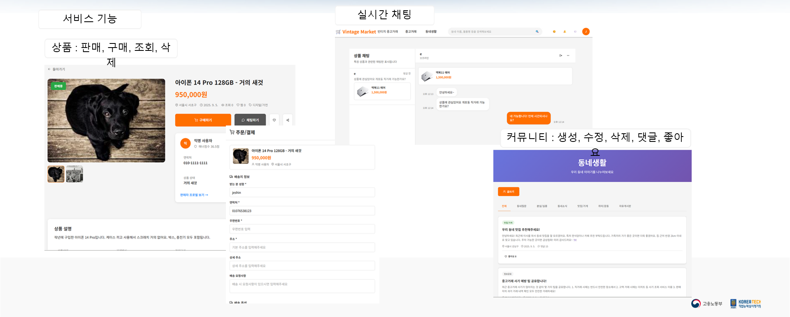

# Vintage Market — 레거시 E-commerce 플랫폼 구축 및 블랙박스 모의해킹

> 실제 운영 환경에서 흔히 발견되는 보안 약점을 가진 레거시 E-commerce 서비스를 재현해 구축하고, CI/CD를 갖춘 운영 환경 위에서 공격자 관점의 블랙박스 진단을 수행한 프로젝트
> * **개발 기간:** 2026.09.02 ~ 2026.09.15
> * **개발 인원:** 4인
> * **주요 역할:** React·Node.js 기반 서비스 구현, Jenkins·Gitea 기반 CI/CD 인프라 구축, SQL Injection 진단, 결과 보고서 작성
> * **사용 기술:** React·React Router, Node.js·Express, Socket.IO, MySQL 8.0·Sequelize, JWT, Docker·Docker Compose, Jenkins, Gitea, MITRE ATT&CK, DFD/STRIDE, Burp Suite, Postman
> * **github:** https://github.com/jeshin119/autoever-security2-redteam
> * **발표 자료:** [Google Slides](https://docs.google.com/presentation/d/1riU8wIi2z-_VI2-U1nVr8rti1VgtU9GIwHG_h8sCNA8/edit?usp=sharing)
> * **상세 보고서:** [Google Docs](https://docs.google.com/document/d/1BKQHNQjZNZ8uO-JT-aFsX8uKic3Orea9c4mF0M2yiaE/edit?usp=sharing)

---

## 1. 프로젝트 개요

가상의 고객사 Vintage Market의 의뢰를 가정해, 모의해킹 대상이 될 중고거래 플랫폼을 구축하고 그 위에서 외부 공격자 관점의 블랙박스 진단을 수행한 프로젝트.

실제 운영 서비스에서 자주 발견되는 보안 약점을 가진 환경을 재현해 위협 시나리오가 성립하도록 구성하는 것이 핵심. 서비스 구현과 CI/CD 인프라 구축을 담당했으며, 구현한 서비스를 공격자 관점에서 진단해 개발 단계에서 놓치기 쉬운 약점을 검증.

---

## 2. 운영 환경 구성

진단 대상이 실제 서비스처럼 동작하도록, 프론트엔드부터 CI/CD까지 운영 가능한 환경을 구성

### 2.1 서비스 구현 (React · Node.js)
- **주요 기능:** 상품 판매·구매, 게시글, 커뮤니티, 실시간 채팅
- **백엔드:** Node.js·Express + Sequelize(MySQL)로 REST API를 구성하고, JWT 기반 인증을 적용
- **실시간 채팅:** Socket.IO로 양방향 통신을 처리하고, 채팅 메시지는 RDBMS(MySQL)에 저장·조회하는 구조로 구현

  
   
  상품 거래·실시간 채팅·커뮤니티 등 주요 기능 화면

### 2.2 CI/CD 인프라 구축 (Jenkins · Gitea)
- 구형 OS로 구성된 기존 개발 서버 제약을 우회하기 위해 최신 Linux 기반 별도 개발 서버를 구성
- Gitea로 소스 형상 관리를, Jenkins로 빌드–배포 파이프라인을 구축해 코드 통합부터 배포까지 자동화
- 팀 전체 개발 환경을 표준화해 구성원 간 환경 차이로 발생하던 오류를 제거

---

## 3. 진단 대상 취약점

레거시 서비스에서 실제로 발생하는 보안 약점을 재현한 환경으로, 어떤 지점이 악용되는지를 설계 단계에서 파악하고 배치한 것이 핵심.

| 취약점 | 발생 지점 | 악용 결과 |
|---|---|---|
| **SQL Injection** | 로그인·채팅 입력값을 검증 없이 쿼리에 문자열로 결합 | 인증 우회, 회원 정보 유출 |
| **Race Condition** | 거래 처리 시 재고 확인과 크레딧 차감 사이 동시성 제어 미적용 | 이중 구매·잔액 변조 |
| **SSTI** | 게시글 입력에 대한 서버 측 동적 코드 평가 로직 | 서버 측 코드 실행 |

거래 로직의 동시성 이슈는 트랜잭션·잠금이 없을 때 Race Condition이 성립하는 구조로, 안전하게 처리하는 방식과 취약해지는 지점을 함께 파악한 결과

---

## 4. 진단 시나리오 및 결과

DFD/STRIDE로 위협을 도출하고 MITRE ATT&CK 기준으로 침투 시나리오를 수립·실증. 외부에서 접근 가능한 자산에서 시작해 내부망·CI/CD까지 이어지는 침해 경로를 확인.

| 시나리오 | 핵심 취약점 | 침투 경로 / 결과 |
|---|---|---|
| 결제 로직 악용 | Race Condition | 거래 동시성 결함으로 이중 구매·잔액 변조 |
| 입력 검증 우회 | SQL Injection | 로그인 인증 우회 후 채팅 쿼리로 회원 정보 유출 |
| 웹서버 → 내부망 침투 | 파일 업로드 RCE | 웹셸로 RCE 확보 후 내부망·CI/CD까지 횡적 이동 |
| 네트워크 가로채기 | ARP Spoofing | 평문 통신 가로채기로 DB 관리 콘솔 접근 |
| 공급망 공격 | 저장소 접근 통제 미흡 | 소스 저장소 백도어 삽입으로 배포 파이프라인 위협 |

이 중 **입력 검증 우회(SQL Injection)** 시나리오를 직접 수행. 로그인 API의 이메일 파라미터에 SQL 구문을 삽입해 인증을 우회하고(T1190), 채팅 메시지 저장 쿼리의 문자열 결합 구조에 추가 쿼리를 주입해 회원 테이블의 이메일·비밀번호 해시·권한 정보를 추출(T1552·T1005). 이후 탈취한 관리자 계정으로 비인가 접근이 가능함을 확인(T1078). 개선 조치로 사용자 입력을 파라미터 바인딩/ORM 쿼리 빌더로 전환하고 입력값 화이트리스트 검증을 추가하도록 권고·적용.

발견 항목별 위험도 평가와 시나리오 상세, 개선 권고는 [상세 보고서](https://docs.google.com/document/d/1BKQHNQjZNZ8uO-JT-aFsX8uKic3Orea9c4mF0M2yiaE/edit?usp=sharing) 참조

